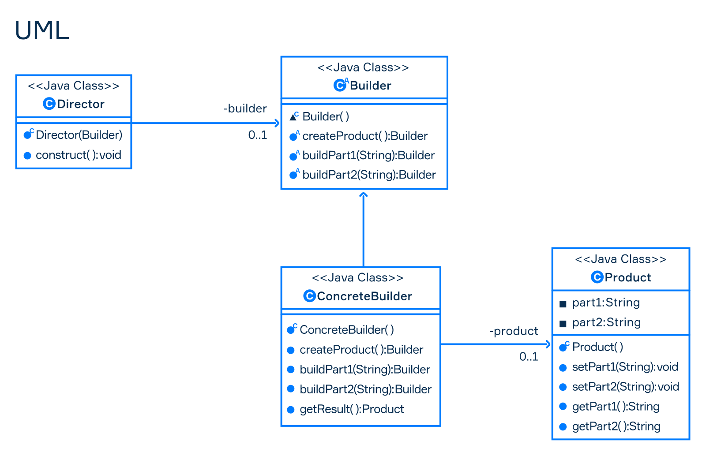

# Builder

**Builder pattern** is a creational pattern that allows you to create objects step by step.



- **Builder**
- **Concrete Builder**
- **Director**
- **Product**

```{literalinclude} code/BuilderPattern.java
:language: java
:linenos:
:lines:

```
