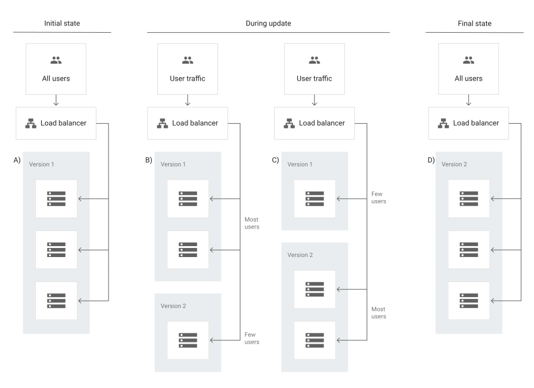
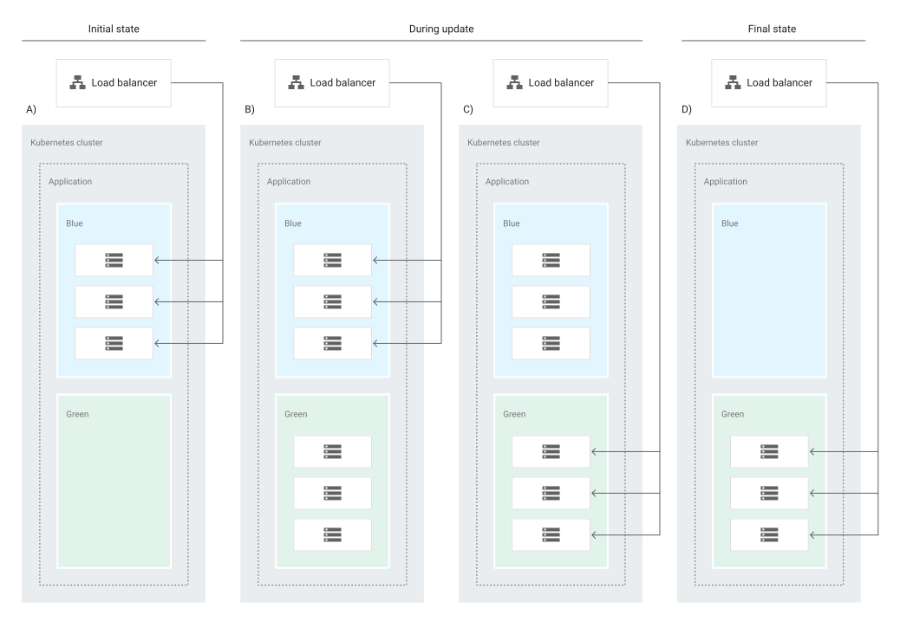

# DevOps

```{toctree}
jenkins
```

## Canary Deployment

A _canary deployment_ is a progressive rollout of an application that splits traffic between an already-deployed version and a new version, rolling it out to a subset of users before rolling out fully.



##

A _blue/green_ deployment



Benefits:

- Zero downtime
- Instant rollback
- Environment separation

Considerations:

- Cost and operational overhead
- Backward compatibility: Shared resources like database
- Cutover
